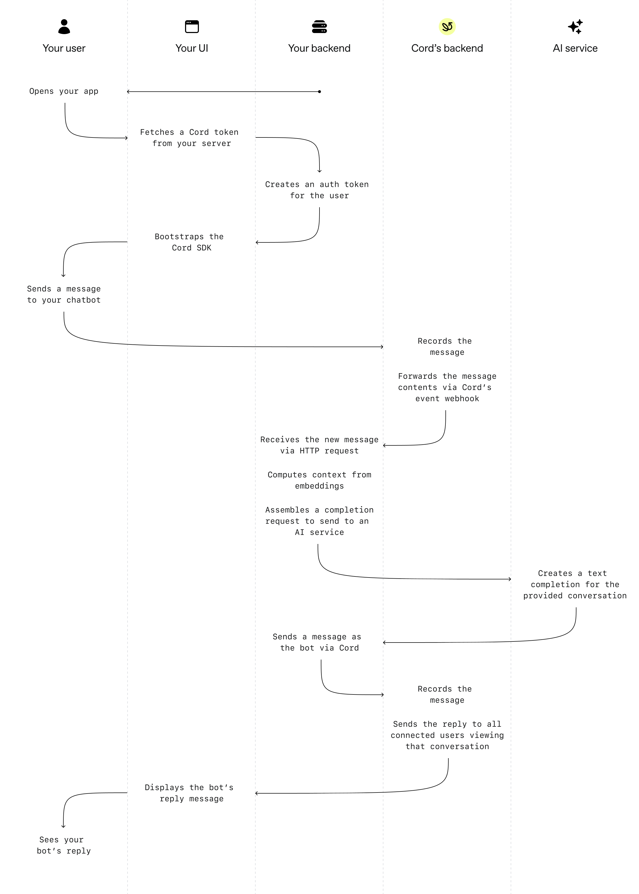

# Chatbot built with Cord and OpenAI

This repo is a template to create an AI Chatbot using [openAI](https://openai.com/) and [Cord](https://cord.com/?utm_source=GitHub&utm_medium=referral&utm_campaign=ai_chatbot).
It's prebuilt with the context about Cord, the collaboration product (not the recruiting one).

## Contents

[How does it work?](#how-does-it-work)

[Local set up](#local-set-up)

- [Set up local server](#set-up-local-server)
- [Client](#set-up-local-client)

[How to configure the bot](#how-to-configure-the-bot)

- [Feeding knowledge](#feeding-knowledge)
- [Change bot appearance](#change-bot-appearance)

[Examples](#examples)

---

# How does it work?

Essentially, you give the bot context on what it knows (its context), and you tell it how to behave,
(it's prompt), then you give it the back-and-forths of a conversation, starting with the user's
first message, and then use OpenAI's chat completion API to fill in the next message.

This library helps you with:

- Generating embeddings from a list of URLs
- Creating a prompt for the bot
- Selecting context data for the bot (using embeddings and cosine similarity)

The client interface is using Cord's SDK to simulate a chatbot. The components from the SDK used are:

- [Thread](https://docs.cord.com/components/cord-thread?utm_source=GitHub&utm_medium=referral&utm_campaign=ai_chatbot)
- [Presence Observer](https://docs.cord.com/components/cord-presence-observer?utm_source=GitHub&utm_medium=referral&utm_campaign=ai_chatbot)
- [Presence Facepile](https://docs.cord.com/components/cord-presence-facepile?utm_source=GitHub&utm_medium=referral&utm_campaign=ai_chatbot)

Server side the following is used:

- [Cord webhook](https://docs.cord.com/reference/events-webhook?utm_source=GitHub&utm_medium=referral&utm_campaign=ai_chatbot) is used to get the message content of what the user (you) are asking the bot.
- [Cord REST APIs](https://docs.cord.com/rest-apis?utm_source=GitHub&utm_medium=referral&utm_campaign=ai_chatbot) - including users, organizations, threads, typing indicators, and user presence.

---

## Network Diagram

.

---

# Local set up

1. Clone this repo and `cd` into cord-openai-chatbot

## Set up local server

After cloning the repo, in your Terminal:

2. `cd` into the server folder.

3. Run `npm install`.

   ```
   💡 Make sure you run npm install within the server folder
   ```

4. Run `npm run generate-dot-env` to generate `.env` template.

5. Enter missing information in `.env`.\
    **Cord credentais**\
    You can find them [here](https://console.cord.com/?utm_source=GitHub&utm_medium=referral&utm_campaign=ai_chatbot) or [sign up](https://console.cord.com/signup?utm_source=GitHub&utm_medium=referral&utm_campaign=ai_chatbot) to get them.\
    \
    **openAI credentials**\
    You can find them [here](https://platform.openai.com/account/api-keys) or sign up to get them.\
   \
    **email address**\
    The email address associated to the user who is talking to the chat bot (you will receive notifications).

6. Run `npm run dev` and your server should be started!

> _Note_ Any changes you make to the server code will only be reflected if you restart your server.

**Specifying the Cord webhook endpoint**

The [webhook](https://docs.cord.com/reference/events-webhook?utm_source=GitHub&utm_medium=referral&utm_campaign=ai_chatbot) allows you to receive events from Cord, the types of events you can see can be calibrated in the [Cord Console](https://console.cord.com?utm_source=GitHub&utm_medium=referral&utm_campaign=ai_chatbot).

7. If you are running this locally, you will need to open up access to your localhost by using [ngrok](https://ngrok.com) or something similar.

8. Using [ngrok](https://ngrok.com), sign up and follow the instructions to install `ngrok`. \
    Then run in your terminal `ngrok http http://localhost:4000` making sure you insert what is specified in the hostname and port in your `.env`.\
   You will then get a web url (e.g `https://xxxx-217-213-73-197.ngrok-free.app`) that forwards any traffic to your localhost.

   ```
   💡 Make sure your local server is turned at this point, when you insert the URL in the console, we will send a reuest to that URL and expect a status 200 back.
   ```

9. Log into the [Cord Console](https://console.cord.com?utm_source=GitHub&utm_medium=referral&utm_campaign=ai_chatbot) and select the application you will use, then navigate to app settings, and then to the events tab and enter the webhook url (e.g `https://xxxx-217-213-73-197.ngrok-free.app/cord-webhook` from the step above).

   ```
   💡 Make sure your webhook url also includes the CORD_WEBHOOK_PATH value.
   ```

10. You can change the path `/cord-webhook` to anything you want in the `.env` under `CORD_WEBHOOK_PATH`. Make sure you restart your server if you do.

## Set up local client

After cloning the repo, in your Terminal:

11. `cd` into the client folder.

12. Run `npm install`.

13. Create a `.env` in the client folder and add the below into the newly created `.env` file.

```
# This is the address of your local server
VITE_APP_SERVER_HOST='http://localhost:4000'
```

14. Run `npm run dev` and your local client should be set up! Check using the url given in your terminal.

15. You should see the chat load up and a second later the AI bot will send its first message to you.

---

# How to configure the bot

You can create your own support bot by following the steps below:s

You'll need to change files in `server/botKnowledge`.

## Feeding knowledge

1. In `server/botKnowledge/urls.txt` list all the urls you want the bot to know about.

2. In your terminal run `npm run generate-embeddings` this will take the list of urls and make a get request to extract all the text on that page.
3. In `server/botKnowledge/prompt.txt` you can describe what you require from the bot's response. The `BOT_USER_NAME`, `BOT_ESCAPE_WORD` and `BOT_CONTEXT` are variables that are replaced when the prompt is sent to openAI.

## Change bot appearance

4. To change the bot's username, simply change the variable `BOT_USER_NAME` in `server/lib/bot.ts`.

5. To change the bot's profile picture, replace the image `cordy-avatar.png` in `server/public`.

---

# Examples

## Pokedex

This takes the first 150 pokemon urls and feeds information to the Cord bot.

1. Replace contents in `server/botKnowledge/urls.txt` with the below:
      <details>
      <summary>Show urls for pokemon</summary>

   ```
   https://www.pokemon.com/uk/pokedex/bulbasaur
   https://www.pokemon.com/uk/pokedex/ivysaur
   https://www.pokemon.com/uk/pokedex/venusaur
   https://www.pokemon.com/uk/pokedex/charmander
   https://www.pokemon.com/uk/pokedex/charmeleon
   https://www.pokemon.com/uk/pokedex/charizard
   https://www.pokemon.com/uk/pokedex/squirtle
   https://www.pokemon.com/uk/pokedex/wartortle
   https://www.pokemon.com/uk/pokedex/blastoise
   https://www.pokemon.com/uk/pokedex/caterpie
   https://www.pokemon.com/uk/pokedex/metapod
   https://www.pokemon.com/uk/pokedex/butterfree
   https://www.pokemon.com/uk/pokedex/weedle
   https://www.pokemon.com/uk/pokedex/kakuna
   https://www.pokemon.com/uk/pokedex/beedrill
   https://www.pokemon.com/uk/pokedex/pidgey
   https://www.pokemon.com/uk/pokedex/pidgeotto
   https://www.pokemon.com/uk/pokedex/pidgeot
   https://www.pokemon.com/uk/pokedex/rattata
   https://www.pokemon.com/uk/pokedex/raticate
   https://www.pokemon.com/uk/pokedex/spearow
   https://www.pokemon.com/uk/pokedex/fearow
   https://www.pokemon.com/uk/pokedex/ekans
   https://www.pokemon.com/uk/pokedex/arbok
   https://www.pokemon.com/uk/pokedex/pikachu
   https://www.pokemon.com/uk/pokedex/raichu
   https://www.pokemon.com/uk/pokedex/sandshrew
   https://www.pokemon.com/uk/pokedex/sandslash
   https://www.pokemon.com/uk/pokedex/nidoran-male
   https://www.pokemon.com/uk/pokedex/nidorina
   https://www.pokemon.com/uk/pokedex/nidoqueen
   https://www.pokemon.com/uk/pokedex/nidoran-female
   https://www.pokemon.com/uk/pokedex/nidorino
   https://www.pokemon.com/uk/pokedex/nidoking
   https://www.pokemon.com/uk/pokedex/clefairy
   https://www.pokemon.com/uk/pokedex/clefable
   https://www.pokemon.com/uk/pokedex/vulpix
   https://www.pokemon.com/uk/pokedex/ninetales
   https://www.pokemon.com/uk/pokedex/jigglypuff
   https://www.pokemon.com/uk/pokedex/wigglytuff
   https://www.pokemon.com/uk/pokedex/zubat
   https://www.pokemon.com/uk/pokedex/golbat
   https://www.pokemon.com/uk/pokedex/oddish
   https://www.pokemon.com/uk/pokedex/gloom
   https://www.pokemon.com/uk/pokedex/vileplume
   https://www.pokemon.com/uk/pokedex/paras
   https://www.pokemon.com/uk/pokedex/parasect
   https://www.pokemon.com/uk/pokedex/venonat
   https://www.pokemon.com/uk/pokedex/venomoth
   https://www.pokemon.com/uk/pokedex/diglett
   https://www.pokemon.com/uk/pokedex/dugtrio
   https://www.pokemon.com/uk/pokedex/meowth
   https://www.pokemon.com/uk/pokedex/persian
   https://www.pokemon.com/uk/pokedex/psyduck
   https://www.pokemon.com/uk/pokedex/golduck
   https://www.pokemon.com/uk/pokedex/mankey
   https://www.pokemon.com/uk/pokedex/primeape
   https://www.pokemon.com/uk/pokedex/growlithe
   https://www.pokemon.com/uk/pokedex/arcanine
   https://www.pokemon.com/uk/pokedex/poliwag
   https://www.pokemon.com/uk/pokedex/poliwhirl
   https://www.pokemon.com/uk/pokedex/poliwrath
   https://www.pokemon.com/uk/pokedex/abra
   https://www.pokemon.com/uk/pokedex/kadabra
   https://www.pokemon.com/uk/pokedex/alakazam
   https://www.pokemon.com/uk/pokedex/machop
   https://www.pokemon.com/uk/pokedex/machoke
   https://www.pokemon.com/uk/pokedex/machamp
   https://www.pokemon.com/uk/pokedex/bellsprout
   https://www.pokemon.com/uk/pokedex/weepinbell
   https://www.pokemon.com/uk/pokedex/victreebel
   https://www.pokemon.com/uk/pokedex/tentacool
   https://www.pokemon.com/uk/pokedex/tentacruel
   https://www.pokemon.com/uk/pokedex/geodude
   https://www.pokemon.com/uk/pokedex/graveler
   https://www.pokemon.com/uk/pokedex/golem
   https://www.pokemon.com/uk/pokedex/ponyta
   https://www.pokemon.com/uk/pokedex/rapidash
   https://www.pokemon.com/uk/pokedex/slowpoke
   https://www.pokemon.com/uk/pokedex/slowbro
   https://www.pokemon.com/uk/pokedex/magnemite
   https://www.pokemon.com/uk/pokedex/magneton
   https://www.pokemon.com/uk/pokedex/farfetchd
   https://www.pokemon.com/uk/pokedex/doduo
   https://www.pokemon.com/uk/pokedex/dodrio
   https://www.pokemon.com/uk/pokedex/seel
   https://www.pokemon.com/uk/pokedex/dewgong
   https://www.pokemon.com/uk/pokedex/grimer
   https://www.pokemon.com/uk/pokedex/muk
   https://www.pokemon.com/uk/pokedex/shellder
   https://www.pokemon.com/uk/pokedex/cloyster
   https://www.pokemon.com/uk/pokedex/gastly
   https://www.pokemon.com/uk/pokedex/haunter
   https://www.pokemon.com/uk/pokedex/gengar
   https://www.pokemon.com/uk/pokedex/onix
   https://www.pokemon.com/uk/pokedex/drowzee
   https://www.pokemon.com/uk/pokedex/hypno
   https://www.pokemon.com/uk/pokedex/krabby
   https://www.pokemon.com/uk/pokedex/kingler
   https://www.pokemon.com/uk/pokedex/voltorb
   https://www.pokemon.com/uk/pokedex/electrode
   https://www.pokemon.com/uk/pokedex/exeggcute
   https://www.pokemon.com/uk/pokedex/exeggutor
   https://www.pokemon.com/uk/pokedex/cubone
   https://www.pokemon.com/uk/pokedex/marowak
   https://www.pokemon.com/uk/pokedex/hitmonlee
   https://www.pokemon.com/uk/pokedex/hitmonchan
   https://www.pokemon.com/uk/pokedex/lickitung
   https://www.pokemon.com/uk/pokedex/koffing
   https://www.pokemon.com/uk/pokedex/weezing
   https://www.pokemon.com/uk/pokedex/rhyhorn
   https://www.pokemon.com/uk/pokedex/rhydon
   https://www.pokemon.com/uk/pokedex/chansey
   https://www.pokemon.com/uk/pokedex/tangela
   https://www.pokemon.com/uk/pokedex/kangaskhan
   https://www.pokemon.com/uk/pokedex/horsea
   https://www.pokemon.com/uk/pokedex/seadra
   https://www.pokemon.com/uk/pokedex/goldeen
   https://www.pokemon.com/uk/pokedex/seaking
   https://www.pokemon.com/uk/pokedex/staryu
   https://www.pokemon.com/uk/pokedex/starmie
   https://www.pokemon.com/uk/pokedex/mr-mime
   https://www.pokemon.com/uk/pokedex/scyther
   https://www.pokemon.com/uk/pokedex/jynx
   https://www.pokemon.com/uk/pokedex/electabuzz
   https://www.pokemon.com/uk/pokedex/magmar
   https://www.pokemon.com/uk/pokedex/pinsir
   https://www.pokemon.com/uk/pokedex/tauros
   https://www.pokemon.com/uk/pokedex/magikarp
   https://www.pokemon.com/uk/pokedex/gyarados
   https://www.pokemon.com/uk/pokedex/lapras
   https://www.pokemon.com/uk/pokedex/ditto
   https://www.pokemon.com/uk/pokedex/eevee
   https://www.pokemon.com/uk/pokedex/vaporeon
   https://www.pokemon.com/uk/pokedex/jolteon
   https://www.pokemon.com/uk/pokedex/flareon
   https://www.pokemon.com/uk/pokedex/porygon
   https://www.pokemon.com/uk/pokedex/omanyte
   https://www.pokemon.com/uk/pokedex/omastar
   https://www.pokemon.com/uk/pokedex/kabuto
   https://www.pokemon.com/uk/pokedex/kabutops
   https://www.pokemon.com/uk/pokedex/aerodactyl
   https://www.pokemon.com/uk/pokedex/snorlax
   https://www.pokemon.com/uk/pokedex/articuno
   https://www.pokemon.com/uk/pokedex/zapdos
   https://www.pokemon.com/uk/pokedex/moltres
   https://www.pokemon.com/uk/pokedex/dratini
   https://www.pokemon.com/uk/pokedex/dragonair
   https://www.pokemon.com/uk/pokedex/dragonite
   https://www.pokemon.com/uk/pokedex/mewtwo
   https://www.pokemon.com/uk/pokedex/mew
   ```

      </details>
   <br/>

2. In your terminal run `npm run generate-embeddings` this will take the list of
   urls and make a get request to extract all the text on that page.
3. In `server/botKnowledge/prompt.txt` replace the contents with the below:

      <details>
      <summary>Show prompt for pokemon</summary>

   ```
   You are called BOT_USER_NAME. You are helping someone who is a Pokemon trainer.
   Many of the questions you'll face will be about Pokemon. Do not allow the people you are chatting with to go off
   topic. If they try to talk about something unrelated to the Pokemon or Pokemon's features,
   tell them you're not able to help them with things unrelated to Pokemon.
   Do not use your existing knowledge.
   Do not guess about things -- stick to the documentation.
   Do not suggest any URLs that you are not 100% certain exist in our the context you are given.
   Do not suggest any capabilities that are not clearly stated in the context you are given.
   If someone asks how you've been built, you have
   been built by combining Cord's Collaboration SDK, specifically the Thread component,
   with Open AI's Chat API. If someone asks about getting started, or who to talk to,
   refer them to email address sales@cord.com.

   You have the following context:
   BOT_CONTEXT

   Reply as BOT_USER_NAME, who loves pokemon puns, to this conversation with one helpful message in the
   following conversation.
   ```

      </details>
   <br/>
